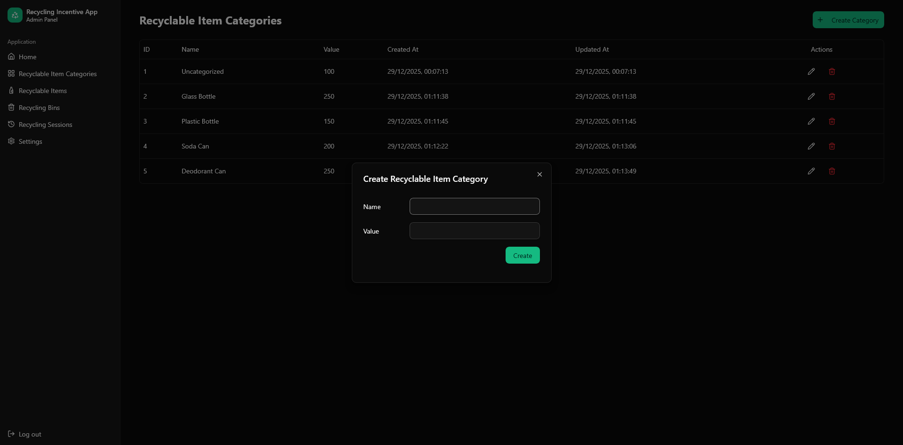
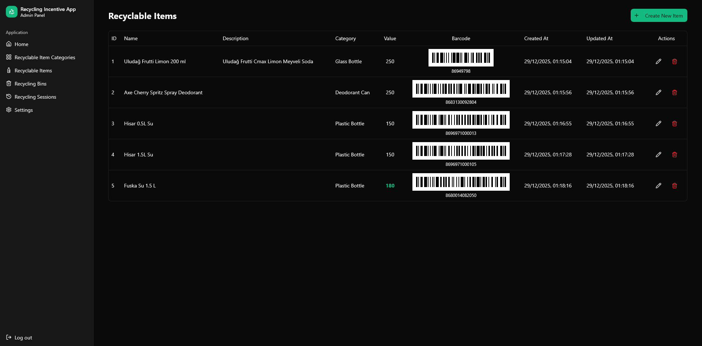
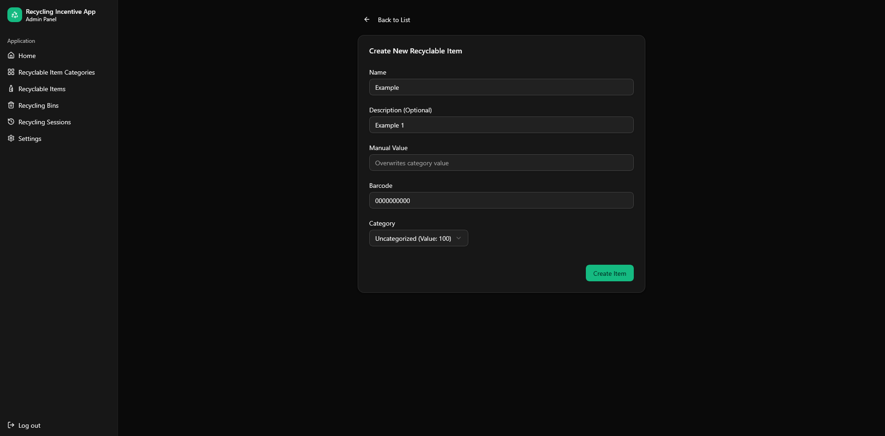
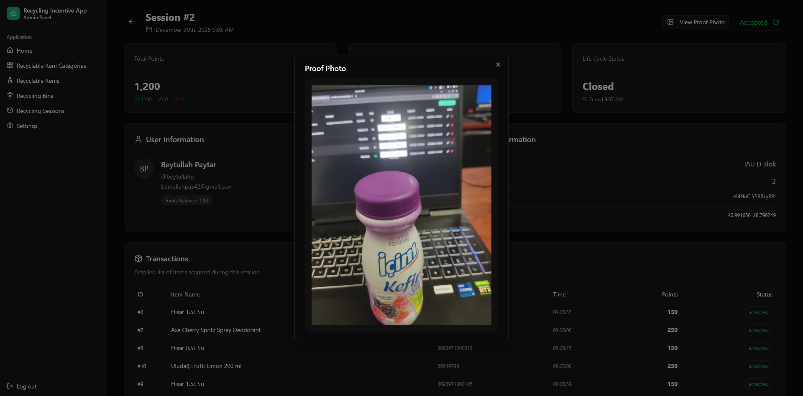
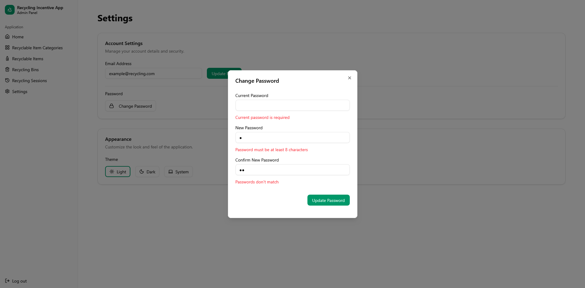

# Recycling Incentive App - Admin Dashboard

This is the administrative control panel for the **Recycling Incentive App**, developed as a **Tubitak 2209-A** research project.

The dashboard allows administrators to manage the entire recycling ecosystem, including verifying flagged transactions, managing recycling bins, and configuring recyclable items.

---

## ✨ Features

- **Session Verification:** detailed view to audit "Flagged" recycling sessions. Admins can accept or reject sessions based on the uploaded proof photo.
- **Resource Management:** Full CRUD capabilities for:
  - 🚮 **Recycling Bins:** Generate and print QR codes for new bins.
  - ♻️ **Recyclable Items:** Configure point values and generate barcodes for items.
  - 📂 **Categories:** Organize items into categories.
- **QR & Barcode Generation:** Built-in tools to generate necessary printables (`qrcode.react`, `react-barcode`).
- **User Management:** View registered users and their balances.

---

## 🛠️ Used Technologies

- **React 19**
- **Vite**
- **TypeScript**
- **Shadcn UI** (Radix UI + Tailwind)
- `react-hook-form` + `zod` for robust form validation
- `axios` for API communication

---

## 🔗 Links & Access

- 📦 **Backend Repository:** https://github.com/Beytullahp42/recycling-incentive-app-backend
- 📦 **Mobile App Repository:** https://github.com/Beytullahp42/recycling-incentive-app-expo

- 🌐 **Hosted Admin Dashboard:** https://ria-admin.beytullahp.com
- 🔗 **Hosted Backend API:** https://ria-backend.beytullahp.com

---

## 📸 Screenshots

 

 

 

 

